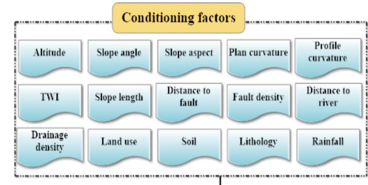
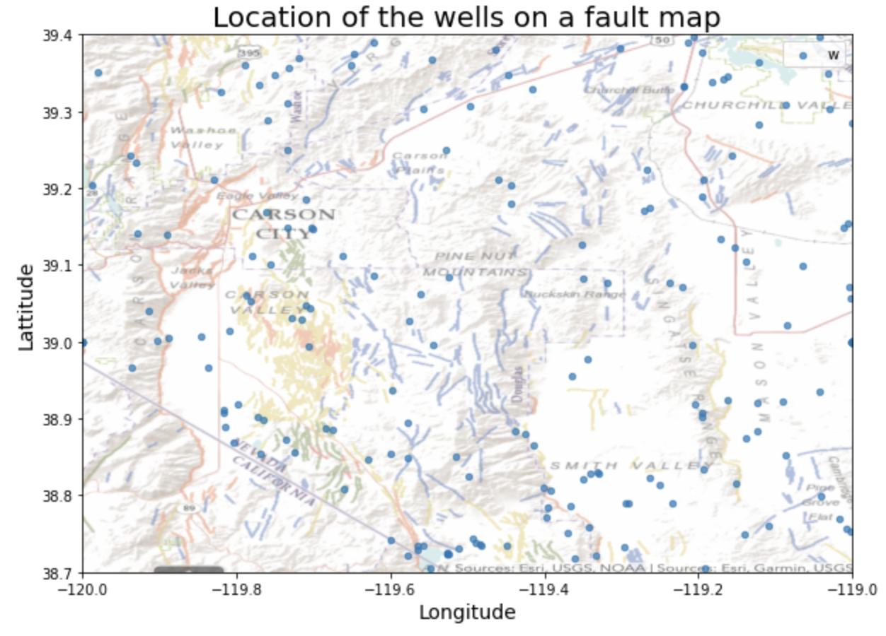

<!-- PROJECT LOGO -->
 

  

  <h3 align="center">Well Well : AI to find best well location</h3>

  

    Machine Learning project to help communities find the best water well location and get access to clean water 
     
    <a href="https://www.youtube.com/watch?v=CnvxaTBWoZo"><stron>Watch the video »</strong></a>
     
     
    <a href="https://www.wellwell-cfc.com/">View Demo</a>
    ·
    <a href="https://github.com/adelsaadeddin/wellwell/issues">Report Bug</a>
    ·
    <a href="hhttps://github.com/adelsaadeddin/wellwell/issues">Request Feature</a>
  

 
 

This is a project submission for the 2021 IBM **Call for Code Challenge**. 

The 2021 IBM Call for Code Challenge is a global contest to fight **Climate Change**, which focuses on 3 domains, one of them being **access to clean water.** 
8oo million people in the world dont have access to clean water today. Some communities try to drill water wells, but **they need help to know the best potential location**, before they start drilling. Why not use a little bit of AI to help them out?

Watch this [short video](https://www.youtube.com/watch?v=CnvxaTBWoZo) to have a better idea of what we are all about.

Team members: 
- Pierre Schwob (Master in Data Science, [Harbour Space](https://harbour.space) / [UTCC](https://www.utcc.ac.th))
- Adel Saadeddin (Master in Data Science, [Harbour Space](https://harbour.space), and world finalist in the famous ICPC coding competition)
- Mazen Hassani (Master in Data Science, [Harbour Space](https://harbour.space), and multiple awards winner in robotics)
 

<!-- TABLE OF CONTENTS -->
## Table of Contents

* [About the Project](#about-the-project)
  * [Built With](#built-with)
* [Machine Learning module](#machine-learning-module)
  * [Built With](#overview)
  * [More Explanations](#more-explanations)
* [Physical Device](#physical-device)
* [Contributing](#contributing)
* [License](#license)
* [Contact](#contact)
* [Acknowledgements](#acknowledgements)

<!-- ABOUT THE PROJECT -->
## About The Project

What if, Machine Learning could help people find the best water wells location in a more **systematic and inexpensive way**. With Well well, our project using **machine learning and robotics** expertise, we propose a 2 part solution to this problem:
<li>the first module, is a <strong>free web application</strong> that takes a single input,  the GPS location of any point in the world. Using a combination of geological features map, satellite imagery and Machine Learning, this web application will then predict the best places to drill a water well <strong>within walking distance</strong>. It can be used on <strong>any mobile phone</strong> anywhere in the world. </li>
<li>And we also thought about the countless people who don't have access to clean water and also <strong>do not have access to a mobile phone or even to the internet</strong>, that's why we also added a second module to our project, which is a cheap <strong>portable device</strong>, costing only <strong>under 10 USD</strong>. This device will store some <strong>precomputed</strong> ideal locations for wells all around the world. It will be able to detect the current the GPS location of any user,  and <strong>guide him or her</strong> to the nearest ideal place to drill a water well.</li>
 

The scientific literature is full of examples on how machine learning can help predict **Groundwater mapping potential**, using information available on maps like the distance to nearest river, the vegetation nearby, the soil composition and so on...If like us you think it is time to bring those amazing ideas to life with a cheap and practical solution, answer the call and join us because for people in developing countries, access to clean water can **change everything**.

### Built With
Here are the major frameworks that we built our project with.
* [IBM data Pak](https://www.ibm.com/products/cloud-pak-for-data)
* [ESRI](https://www.esri.com/en-us/home)

<!-- MACHINE LEARNING MODULE -->
## Machine Learning Module

### Overview

The **final goal** of the project was clear to us very fast: "How to help people find the best location for a water well". But how to translate that into a **mathematical problem statement** that can be properly solved by a Machine Learning Module?

* First we had to get some **deeper knowledge** on this domain. We therefore built a [questionnaire](https://github.com/adelsaadeddin/wellwell/blob/main/misc/Questionnaire_for_hydrologists.pdf) with a lot of questions to be asked to as many **hydrologists** as possible.
* Second, we read as many scientific papers on the subject called "Groundwater mapping potential". Those are grouped in the [litterature review directory](https://github.com/adelsaadeddin/wellwell/tree/main/litterature_review) of this repo

Finally, we were able to state our mathematical problem statement as follow: "For a given map around the GPS location of the end user, we want to be able to predict for each GPS location within walking distance, what is the **probability** that this location is a **good location to drill a water well**."

And according to the scientific litterature, many factors can be taken into account to predict this probabiity of "good location for a well". Here are some of the features most commonly used:

 

  

### More explanations

#### Data Collection

In order to solve the mathematical problem statement, we needed to have access to some datasets. We were mostly interested in **datasets in Africa** and we spent a long time looking for them. The results of our searches can be found in the [datasets/Africa](https://github.com/adelsaadeddin/wellwell/tree/main/datasets/Africa) directory.

However it was really difficult to find datasets with enough datapoints in Africa. That's why eventually we focused on a dataset of 50,000 wells in Nevada, downloaded on this [website](http://water.nv.gov/mapping.aspx?mapping=Well%20Drilling%20and%20Dam%20Data). While our main goal is not to build water wells in the United States(even if it would be a good thing too), we decided to focus on this area first, to advance our Machine Learning model, with the idea that we could use **transfer learning** to move our findings to Africa later. Data collection for our project is not that easy, and that's why we would be happy in the future to have some funding to pursue this dataset collection in Africa. Maybe this submission to the IBM Call for Code Challenge can give us more legitimity to convince governement bodies to share wells data with us.

You can have a look at our **dataset exploration** on this [notebook](https://dataplatform.cloud.ibm.com/analytics/notebooks/v2/e88bda12-5d09-4edd-acae-3eda798d8a3e/view?access_token=c10ecb8efbeaa0e325c1ba56e059c8ed9dd6e92a31709112f1836653a14e4c9d) on IBM Watson.

#### Negative Samples

Once we started working on our dataset, our dataset was what we call "positive samples" (more precisely, we only kept the wells with a **yield superior to a given threshold**, to be our positive samples). To train our model, that can predict probability values between 0 and 1, we also need **"negative samples"**. We plan to try out the following methods:
1. For each good well, take all the closest wells to it, calculate the center of mass: this is a bad location because it is too close to the other wells
2. Use **hydrologist expertise** to select bad locations for wells
3. **Random selection** on the map
4. Use more criteria on the wells to basically **rank them by quality**

It would be interesting in the future to compare those different strategies to generate the negative samples. But at this point, we were just trying to establish a **proof of concept** for our project. We kept it simple and just used random generation. Here is what the map of the wells look like:

 

  

#### Feature generation

It seems that "Geology is the single most important factor determining
groundwater occurrence." ([source](https://www.researchgate.net/publication/335223999_Review_Advances_in_groundwater_potential_mapping)).

Therefore, it is natural that we started by adding this as a mandatory feature. We were able to downloaded a Nevada fault map from [ESRI](https://gisweb.unr.edu/QuaternaryFaults/). We then digitalized that image, and used it to calcutate the distance to each different kind of fault, creating 7 distinct features.

More details on the techniques we used can be found on that [IBM Watson notebook](https://dataplatform.cloud.ibm.com/analytics/notebooks/v2/c2309589-9726-466d-83a5-26b66289d2c7/view?access_token=d38481d58a26c3ac2daf1464e235dc13d8f95bb61218d9a873b7fffb7f8c1741).

Using the same technique, we plan to also add more features, like distance to river, altitude and slope.

#### Model training

Given the small size of the dataset, model training is fast and straightforward, we managed to get **74% accuracy with a Support Vector Machine** model which is rather encouraging at this stage of the project. We should be able to get good accuracy, probably similar to the litterature, once we get access to a bigger dataset.

You can find the model preparation [here](https://dataplatform.cloud.ibm.com/analytics/notebooks/v2/0ac46548-4541-4d77-86dc-66ec84066997/view?access_token=d8202e21c444a76c7c75df59655ed5b01e6edcd153d8a077ee0e05f6b9c11166)

<!-- PHYSICAL DEVICE -->
## Physical Device

 

  

Its mission is to guide the user to the nearest and best well location. It is a **2” device with a microcomputer**, and its **GPS sensor** can detect the user's current location. Because it stores lots of locations precalculated by the AI model, it can then easily guide him or her to the best-nearest location.

Our handheld device was made with **lower income communities** in mind:
* it can be used with **no connectivity**
* no need for a secure access to power sources (we use **ultra low power components**, charged for many weeks within **one day of sunlight**)
* using 4 LEDs as guider arrows towards the right direction
* with the ability to change to the next-best location using a **single button**

<!-- CONTRIBUTING -->
## Contributing

If you are interested in this topic, you too can contribute to this work. Contributions are what will make the project better. Any contributions you make are **greatly appreciated**.

1. Fork the Project
2. Create your Feature Branch (`git checkout -b feature/AmazingFeature`)
3. Commit your Changes (`git commit -m 'Add some AmazingFeature'`)
4. Push to the Branch (`git push origin feature/AmazingFeature`)
5. Open a Pull Request

<!-- LICENSE -->
## License

All this work is fully Open Source, feel free to use it.

<!-- CONTACT -->
## Contact

Feel free to contact us on this repo, we are happy to hear from you.

Project Link: [https://github.com/adelsaadeddin/wellwell](https://github.com/adelsaadeddin/wellwell)

<!-- ACKNOWLEDGEMENTS -->
## Acknowledgements

Thank you to my fellow students for all the wonderfull help on the code, the device building and the project in general. And of course to my teachers for all the good advices:)

<!-- MARKDOWN LINKS & IMAGES -->
<!-- https://www.markdownguide.org/basic-syntax/#reference-style-links -->

